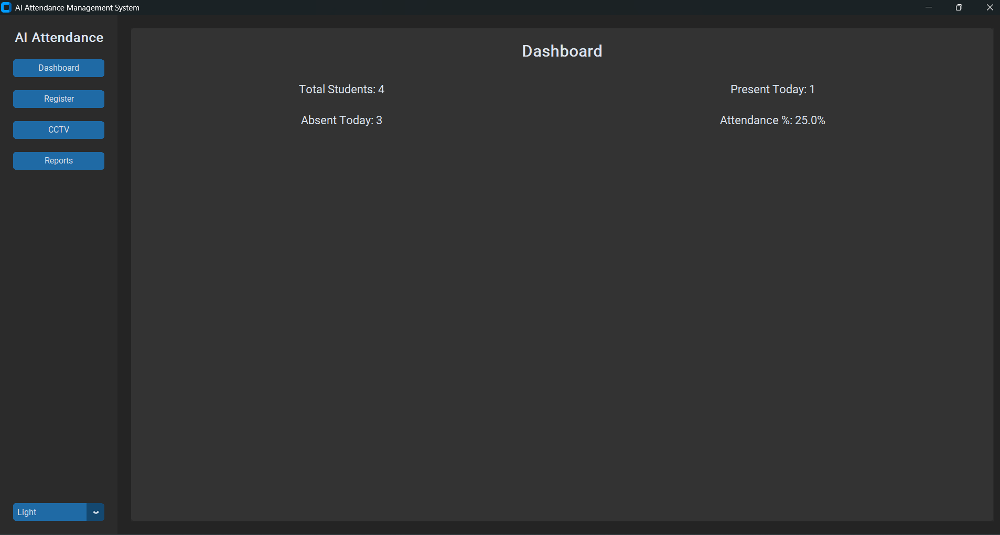
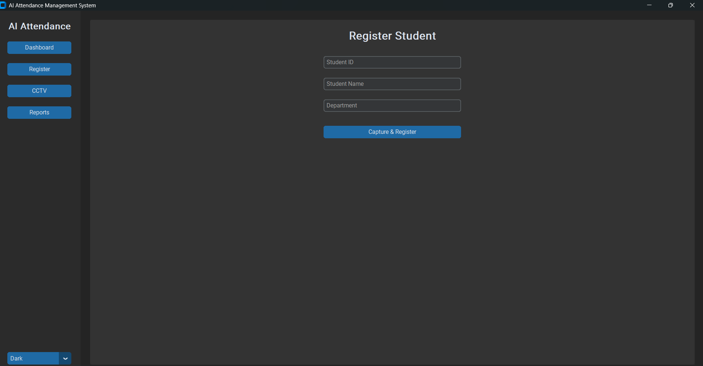
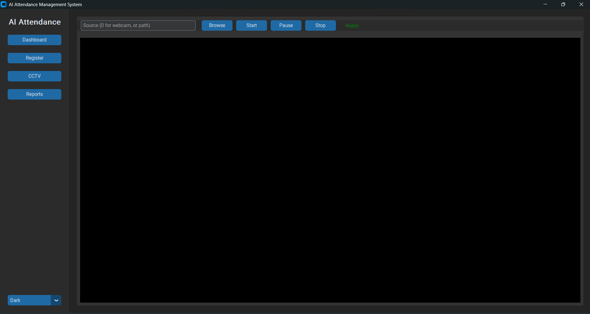
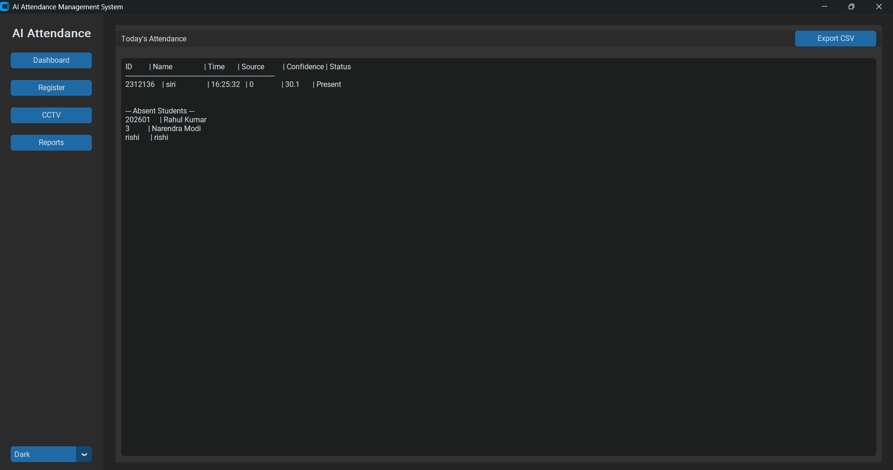

# AI Attendance Management System

This is a robust, CCTV-based AI Attendance Management System.

## Features

- **Student Enrollment:** Capture and register student face embeddings locally (DeepFace).
- **CCTV Video Processing:** Read RTSP streams, local video files, or webcams to process footage.
- **YOLO Person Tracking:** Track people efficiently to prevent repeatedly processing identical faces.
- **DeepFace Recognition:** Deep learning-based face embeddings and similarity scoring.
- **Deduplication:** Prevents marking students multiple times per session/day.
- **Dashboard & Reports:** Modern CustomTkinter GUI for viewing real-time attendance, present/absent students, and exporting reports.

## Architecture

```text
      CCTV Footage / Video / Webcam
              ↓
      Person Detection (YOLOv8)
              ↓
      Object Tracking (ByteTrack)
              ↓
      Face Detection (DeepFace / OpenCV)
              ↓
      Face Recognition (DeepFace)
              ↓
      Student Identification (Cosine Similarity)
              ↓
      Attendance Verification (Cooldown / Daily check)
              ↓
      Attendance Database (SQLite)
              ↓
      Dashboard / Reports (CustomTkinter GUI)
```

## Installation

1. Create a virtual environment and activate it:
```powershell
python -m venv venv
.\venv\Scripts\Activate.ps1
```

2. Install dependencies:
```powershell
python -m pip install -r requirements.txt
```


## Usage

Start the application using:
```powershell
python main.py
```

### 1. Registering Students
- Go to the **Register** tab.
- Enter Student ID, Name, and Department.
- Click **Capture & Register** to open the webcam and capture face samples.
- Press `s` on your keyboard to capture a sample. The system will process embeddings dynamically.
- Capture at least 3 valid samples to finalize registration.

### 2. CCTV Processing
- Go to the **CCTV** tab.
- Enter the source:
  - `0` for default webcam
  - `video.mp4` for a local file
  - `rtsp://username:password@ip/stream` for RTSP IP Camera
- Click **Start** to begin processing. The application will track people, detect faces, and automatically mark attendance when registered students are recognized confidently.
- The UI displays bounding boxes, track IDs, names, confidence scores, and real-time FPS.

### 3. Reports
- Go to the **Reports** tab to see today's attendance summary and export data to a CSV file.
- The dashboard automatically computes the absent students list.

## Application Screenshots

### Dashboard



### Student Registration



### Attendance Recognition



### Attendance Records



## Configuration

Settings can be changed by modifying `configs/config.yaml`:
```yaml
detection:
  confidence: 0.5
  model: "yolov8n.pt"

recognition:
  threshold: 0.40
  model_name: "Facenet"

video:
  frame_skip: 2
  resize_width: 640

attendance:
  duplicate_prevention: true
  cooldown_seconds: 60
```
